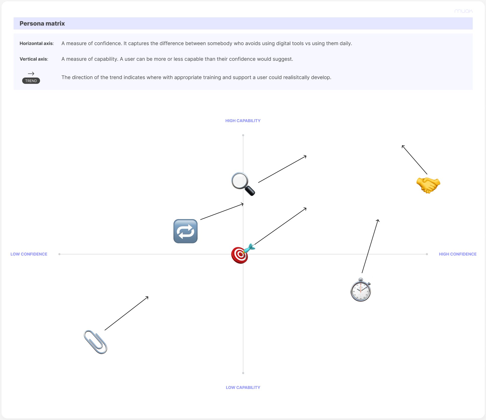
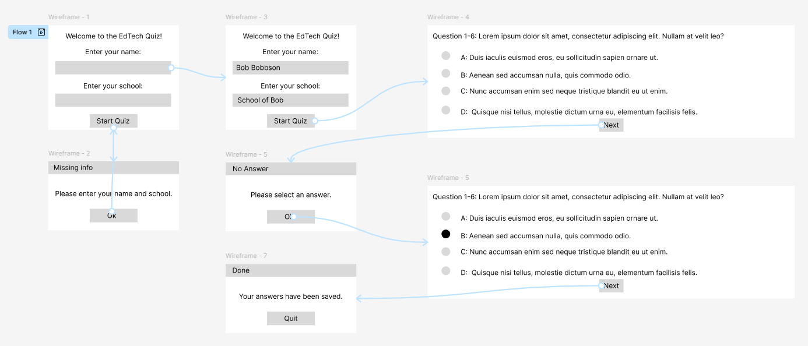
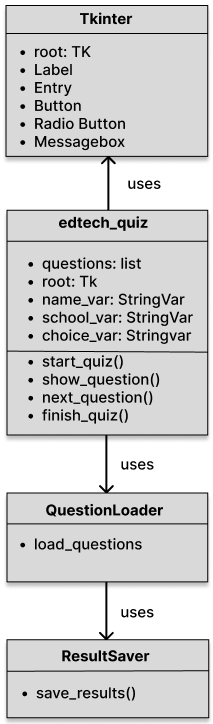
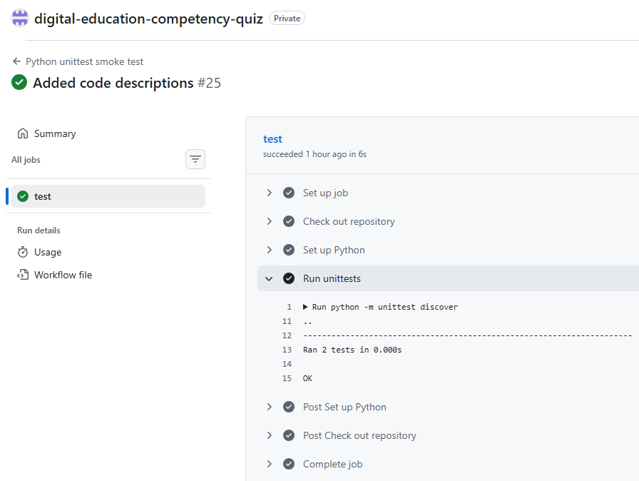
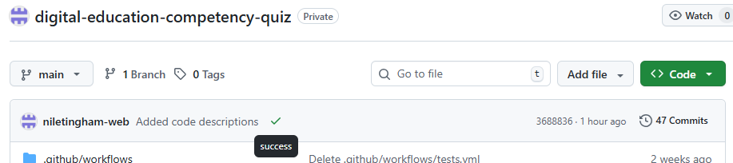
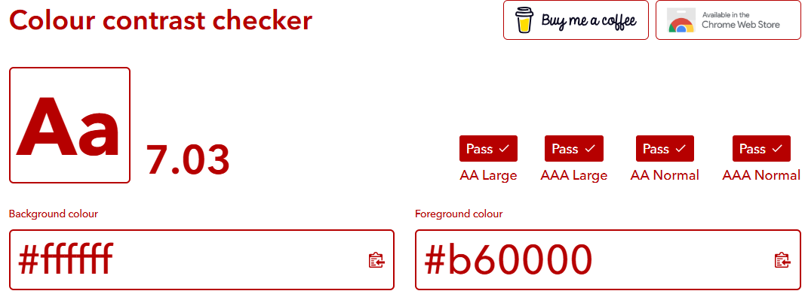

# Digital Education Competency Quiz

The Digital Education Competency (DEC) Quiz App is a minimum viable product developed for the Department for Education (DfE) to support assessment of digital capability across schools in England. The DfE has introduced six core digital standards that will become mandatory from 2030, and the app provides a simple way to gather insight that can inform targeted training and future guidance for the sector.

The desktop application is built using Python and Tkinter. It begins by collecting the user’s name and school before presenting six multiple‑choice questions, each mapped to one of the DfE’s digital standards. The MVP is aimed at school leaders and is designed to explore how they might respond to realistic digital‑related scenarios. The questions are written so that users can apply logic to reach the correct answer, helping build confidence while still offering meaningful data.

Validation rules and GUI prompts ensure that users provide valid information, including acceptable characters for names and schools, and that each question has a selected response. These checks help maintain clean, reliable data suitable for later analysis. Questions are loaded from a CSV file, and user submissions are stored in another CSV, chosen for its accessibility, portability and compatibility with widely used software.

Because the purpose of the app is to gather insight rather than assess performance, no score or correct answers are shown at the end. This avoids implying a pass or fail and keeps the focus on supportive development.

Future iterations could introduce data analysis, visualisation, customisable questions, differentiated access levels and enhanced accessibility features. The MVP keeps scope intentionally limited to core functionality, enabling rapid deployment, early user feedback, stakeholder confidence and a clear direction for future development.

## Design

### User Experience Mapping

I’ve developed a user persona map and a persona matrix to capture the range of personalities and behaviours that exist across the education community. Instead of relying on a single stereotypical profile for each role, this approach is intentionally more inclusive and better reflects real‑world diversity. People in the same position can have very different levels of digital confidence and experience, so a behaviour‑based model provides a more accurate foundation for design decisions. For example, not all governors are retired with low technology confidence; some may work in ICT or digital roles in their day‑to‑day careers. By focusing on behaviours, motivations and capability rather than assumptions about age or background, the personas offer a more representative and equitable view of the users the system needs to support.

### User Personas:

**Figure 1:** Below is my User Persona Map. I have created six personas that can be broadly applied to individuals working across the education sector. The names have been selected carefully to avoid implying bias related to gender, age or ethnicity. Each persona includes an overarching tagline and a more detailed description. Developing this User Persona Map is valuable because it helps shape the design of my application and can support the DfE in planning future training and guidance for schools.


**Figure 1:** User Persona Map


### Personas Matrix:

**Figure 2:** The next item is the User Persona Matrix. This takes the personality profiles from the map and plots how my application, alongside a wider training and guidance package, could support the development of each persona. The horizontal axis represents confidence, while the vertical axis represents actual capability. Each persona is shown using an emoji placed at the point that best reflects their current position, with an arrow indicating the direction in which they could develop in the short to medium term. The overall aim is to move more personas toward higher levels of confidence and capability. This approach also recognises the gap that can exist between perceived and actual ability. For example, the “Cautious User” is highly capable but unlikely to reach the highest levels of confidence due to their naturally cautious disposition. Similarly, the “Confident Collaborator” appears to lose confidence as capability increases; this reflects the idea that greater expertise often brings greater awareness of risk, tempering overconfidence.



**Figure 2:** User Persona Matrix


### GUI Prototyping

**Figure 3:** A wireframe was produced during the initial planning phase to outline how users would move through the quiz. It maps the sequence of interactions, beginning with entering name and school, progressing through each question, and concluding with the submission confirmation. Included in the design are indicative error-handling prompts.

Its purpose was to organise the arrangement of screens, identify where validation should occur, and establish the overall navigation logic before any coding took place. The wireframe focuses purely on flow and interaction rather than visual styling, acting as a structural guide rather than a final design

[Link to live Figma prototype](https://www.figma.com/proto/mCGgaxD7YMgP6cBQVEi0pv/EdTech-Quiz-Prototype?t=HrJ1jBI9K3BsOJIG-1&scaling=min-zoom&content-scaling=fixed&page-id=0%3A1&node-id=1-6&starting-point-node-id=1%3A6) — An interactive prototype quiz application, created in Figma



**Figure 3:** Wireframe


### Functional and Non-Functional Requirements 

Functional Requirements

| ID   | Requirement |
|------|-------------|
| FR1  | The application must allow a participant to enter their name. |
| FR2  | The application must allow a participant to enter their school name. |
| FR3  | The application must validate that both fields are completed before starting the quiz. |
| FR4  | The application must load quiz questions from a CSV file. |
| FR5  | The application must display one question at a time. |
| FR6  | The application must show four answer options (A, B, C, D). |
| FR7  | The application must allow the participant to select exactly one answer per question. |
| FR8  | The application must prevent the participant from progressing without selecting an answer. |
| FR9  | The application must move to the next question after an answer is submitted. |
| FR10 | The application must record all selected answers in order. |
| FR11 | The application must detect when the final question has been answered. |
| FR12 | The application must save the participant’s name, school, and answers to a CSV file. |
| FR13 | The application must create the results file with a header if it does not already exist. |
| FR14 | The application must append new results without overwriting previous entries. |
| FR15 | The application must show warnings for missing information or missing answers. |
| FR16 | The application must show a confirmation message when results are saved. |
| FR17 | The application must close the quiz window after completion. |
| FR18 | The application must support keyboard-only navigation. |
| FR19 | The application must show a clear, non-colour-focused outline for input areas. |
| FR20 | The application must have clear screen-reader-friendly text. |
| FR21 | The application must not impose time-based restrictions. |

Non-Functional Requirements

| ID    | Requirement |
|-------|-------------|
| NFR1  | The interface must be simple and easy for non-technical users to understand. |
| NFR2  | All labels, buttons, and text fields must be clearly visible and readable. |
| NFR3  | The system must handle missing or malformed CSV files gracefully. |
| NFR4  | The system must not crash if the results file already exists. |
| NFR5  | Loading questions must be completed within one second. |
| NFR6  | Saving results must complete within one second. |
| NFR7  | The application must run on Windows systems with Python and Tkinter installed. |
| NFR8  | The application must not require internet access. |
| NFR9  | Pure logic functions must be separated from GUI code. |
| NFR10 | The system must allow unit tests to import functions without launching the GUI. |
| NFR11 | The system must use standard Tkinter widgets compatible with assistive technologies. |
| NFR12 | The system must avoid colour-only cues to ensure clarity for all users. |
| NFR13 | The system must store only name and school; no sensitive data. |
| NFR14 | All data must be stored locally and not transmitted externally. |
| NFR15 | The application must use minimum contrast ratios compliant with WCAG AA standards. |
| NFR16 | Minimum font sizes must meet accessibility guidelines for readability on standard displays. |
| NFR17 | The system must be tested with at least one major screen reader. |
| NFR18 | All warnings and errors must be written in age-appropriate plain English.  |
| NFR19 | Spacing and alignment must remain consistent across all screens to reduce cognitive load. |
| NFR20 | The documentation must include a section describing available accessibility features. |

### Accessibility Assessment

The functional and non-functional requirements work together to create an experience that is accessible, predictable, and inclusive for a wide range of users. Many of the functional requirements directly reduce cognitive load and support assistive technologies. For example, collecting only essential information (FR1–FR3) keeps the onboarding process simple, while a single-question presentation (FR5) and enforced answer selection (FR7–FR8) help users focus on one task at a time. Keyboard-only navigation (FR18), clear input outlines (FR19), and screen reader-friendly text (FR20) ensure that participants who rely on assistive tools can interact with the quiz without barriers. The absence of time limits (FR21) is particularly important for users with processing, motor, or attention-related needs, allowing them to work at their own pace. Clear warnings and confirmations (FR15–FR16) also support users who benefit from explicit feedback or who may struggle with ambiguity.

The non-functional requirements reinforce this foundation by ensuring the interface remains readable, consistent, and compatible with accessibility standards. Readable labels and minimum contrast ratios (NFR2, NFR15–NFR16) support users with low vision, while avoiding colour-only cues (NFR12) ensures that information is not lost for colour blind participants. Compatibility with standard Tkinter widgets (NFR11) and testing with a screen reader (NFR17) help guarantee that assistive technologies can interpret the interface reliably. Requirements such as simple design (NFR1), consistent spacing (NFR19), and plain-English warnings (NFR18) reduce cognitive load and make the quiz approachable for younger users or those with learning differences. Local data storage (NFR13–NFR14) also protects privacy by limiting the amount and sensitivity of information collected. Together, these requirements create a quiz environment that is accessible by design rather than as an afterthought.

### Tech Stack Online 

- [Python 3](https://docs.python.org/3/) — Core programming language. Used for all application logic, file handling, and user interaction.
- [Tkinter](https://docs.python.org/3/library/tkinter.html) — Desktop graphical user interface. Provides the graphical interface for entering user details and navigating quiz questions.
- [csv](https://docs.python.org/3/library/csv.html) — Local data storage in CSV format. Stores quiz questions, answers and user data.
- [unittest](https://docs.python.org/3/library/unittest.html) — Automated unit testing. Used for smoke tests and functional checks of pure functions.

### Code Design Document

The conceptual UML Class Diagram below demonstrates the overall structure of the quiz application. At its centre is the edtech_quiz class, which manages the quiz flow, user interface state, and user inputs. It holds the questions, the Tkinter window, and the variables that track the user’s name, school, and answer choices. Its methods represent the lifecycle of the quiz, from starting it to showing each question, moving forward, and finally completing the session.

Supporting this main class are two focused helper classes: QuestionLoader, responsible for retrieving or preparing the questions, and ResultSaver, which handles storing or exporting the final results. The diagram shows that the quiz class depends on these helpers but does not inherit from them, emphasising a clean separation of responsibilities. The diagram demonstrates a well‑structured, maintainable design where each class has a clear purpose, and the main controller orchestrates the quiz experience.



**Figure 4:** Conceptual UML Class Diagram

## Development Section

This section examines the code behind my quiz application, explaining the purpose and behaviour of each part of the program to show how the different components work together to create the full functionality.

1. Importing Modules

```
import csv
import tkinter as tk
from tkinter import messagebox
```

- csv module is used to read the questions and write the results
- tkinter module provides the GUI framework
- messagebox module is used for pop‑up warnings and confirmation messages

These modules form the foundation of the application.

2. Loading Questions

```
def load_questions(filename):
    with open(filename, newline='', encoding='utf-8') as f:
        return list(csv.DictReader(f))
```

- Opens a CSV file containing quiz questions
- Uses csv.DictReader to convert each row into a dictionary
- UTF-8 tells Python what character format to use when reading the file
- Returns a list of question dictionaries

This allows you to store questions externally and update them without changing the Python code.

3. Saving Results

```
def save_results(filename, name, school, answers):
    header = ["name", "school"] + [f"Q{i+1}" for i in range(len(answers))]

    try:
        with open(filename, "x", newline='', encoding='utf-8') as f:
            writer = csv.writer(f)
            writer.writerow(header)
    except FileExistsError:
        pass

    with open(filename, "a", newline='', encoding='utf-8') as f:
        writer = csv.writer(f)
        writer.writerow([name, school] + answers)
```

- Creates a header row the first time the file is created
- Error handling prevents deletion of previous results
- Appends each user’s name, school, and answers to the CSV file

This ensures quiz results are stored persistently and can be analysed later.

4. Starting the Quiz

```
def start_quiz():
    name = name_var.get().strip()
    school = school_var.get().strip()

    if name == "" or school == "":
        messagebox.showwarning("Missing info", "Please enter your name and school.")
        return

    show_question(0, [])
```


- Retrieves the user’s name and school
- Validates that both fields are filled
- Starts the quiz by calling show_question() with:
- 0 → first question
- [] → empty answer list

This ensures all neccessary information is captured and displays a message prompting the user when incomplete.

5. Displaying a Question

```
def show_question(question_number, answers_so_far):
    for widget in root.winfo_children():
        widget.destroy()

    question = questions[question_number]

    tk.Label(
        root,
        text=f"Question {question_number + 1}: {question['question']}",
        wraplength=1000,
        justify="left"
    ).pack(anchor="w")

    choice_var.set("")

    for option in ["a", "b", "c", "d"]:
        text = f"{option.upper()}: {question[option]}"
        tk.Radiobutton(
            root,
            text=text,
            variable=choice_var,
            value=option,
            wraplength=950,
            justify="left"
        ).pack(anchor="w")

    tk.Button(
        root,
        text="Next",
        command=lambda: next_question(question_number, answers_so_far)
    ).pack(pady=10)
```

- Clears the window so each question appears on a fresh screen
- Displays the question text
- Creates four radio buttons for answer choices
- Adds a Next button

This function controls the main quiz interface and ensures each question is shown cleanly and consistently.

6. Moving to the Next Question
```
def next_question(question_number, answers_so_far):
    selected = choice_var.get()

    if selected == "":
        messagebox.showwarning("No answer", "Please select an answer.")
        return

    new_answers = answers_so_far + [selected]

    if question_number + 1 < len(questions):
        show_question(question_number + 1, new_answers)
    else:
        finish_quiz(new_answers)
```

- Ensures the user has selected an answer
- Adds the selected answer to the list
- Either: Loads the next question, or ends the quiz

7. Finishing the Quiz

```
def finish_quiz(all_answers):
    save_results("results.csv", name_var.get(), school_var.get(), all_answers)
    messagebox.showinfo("Done", "Your answers have been saved.")
    root.destroy()
```

- Saves the user’s answers
- Shows a confirmation message
- Closes the application

8. Building the Main Window

```
root = tk.Tk()
root.title("EdTech Quiz")
root.geometry("1000x350")
root.configure(bg="#FFFFFF")

root.option_add("*Background", "#FFFFFF")
root.option_add("*Foreground", "#B60000")
root.option_add("*Font", "Sans-Serif 16")
```

- Creates the main Tkinter window
- Sets:
- Window size
- Background colour
- Default text colour
- Default font

This ensures a consistent visual style.

9. Welcome Screen and User Inputs

```
tk.Label(
    root,
    text="Welcome to the EdTech Quiz!\n\nPlease enter your name and school below, then click the Start Quiz button.\nYou will then be asked six questions, select one answer per question and confirm by clicking Next.",
    wraplength=950,
    justify="center"
).pack(pady=20)

tk.Label(root, text="Enter your name:").pack()
tk.Entry(root, textvariable=name_var).pack()

tk.Label(root, text="Enter your school:").pack()
tk.Entry(root, textvariable=school_var).pack()

tk.Button(root, text="Start Quiz", command=start_quiz).pack(pady=10)
```

- Displays a welcome message and instructions for completion
- Provides input fields for name and school
- Adds a button to begin the quiz

This is the first screen the user sees.

10. Main Loop

```
root.mainloop()
```

- Starts Tkinter’s event loop
- Keeps the window open and responsive


## Testing Section

To ensure that my applicaton was reliable, accessible, and functionally complete, I adopted a systematic and strategic approach to testing. My testing process combined manual testing against the functional and non‑functional requirements with automated unit testing executed through a continuous integration (CI) pipeline on GitHub. Using both methods allowed me to validate the behaviour of the application from two complementary perspectives: manual testing confirmed that the user experience and interface behaved as intended, while automated unit tests verified the correctness of the underlying logic in a repeatable and objective way.

### Manual Testing

Manual testing was used to verify that the application met all functional and non‑functional requirements. This involved interacting with the quiz application as an end user would: entering data, navigating through questions, selecting answers, and confirming that the system responded correctly at each stage. Manual testing was particularly important for validating:

- User interface behaviour
- Accessibility features
- Error messages and warnings
- Input validation
- Navigation flow
- File creation and data storage

This method allowed me to observe the real‑world usability of the application and ensure that it behaved consistently across different scenarios

### Automated Unit Testing

To complement manual testing, I implemented automated unit tests using Python’s unittest framework. These tests were run automatically through a GitHub continuous integration pipeline, ensuring that every commit triggered a fresh test run. This approach provided several advantages:

- Early detection of regressions
- Confidence that core functions behave consistently
- Repeatable, objective verification
- Separation of logic from GUI code (supporting NFR9 and NFR10)

The automated tests focused on two critical functions: loading questions from a CSV file and saving results to a new or existing CSV file

Below is the unit testing script used in the CI pipeline:

```
import os
import unittest
from edtech_quiz import load_questions
from edtech_quiz import save_results

class TestQuiz(unittest.TestCase):

    def test_load_questions(self):
        questions = load_questions("questions.csv")
        self.assertIsInstance(questions, list)
        self.assertGreater(len(questions), 0)

    def test_save_results(self):
        test_file = "test_results.csv"

        if os.path.exists(test_file):
            os.remove(test_file)

        save_results(test_file, "Test User", "Test School", ["a", "b", "c"])

        self.assertTrue(os.path.exists(test_file))

if __name__ == "__main__":
    unittest.main()
```    

This script checks that the question‑loading function returns a valid list and that the results‑saving function correctly creates a CSV file when required

### Manual Testing Outcomes

The table below summarises the results of my manual testing against each functional requirement.

| ID   | Requirement | Result | Notes |
|------|-------------|--------|-------|
| FR1  | The application must allow a participant to enter their name. | Pass | Field for entering name. |
| FR2  | The application must allow a participant to enter their school name. | Pass | Field for entering school. |
| FR3  | The application must validate that both fields are completed before starting the quiz. | Pass | Message appears if incomplete. |
| FR4  | The application must load quiz questions from a CSV file. | Pass | Questions loaded from questions.csv file. |
| FR5  | The application must display one question at a time. | Pass | One question is displayed at a time. |
| FR6  | The application must show four answer options (A, B, C, D). | Pass | 4 multiple-choice answers available. |
| FR7  | The application must allow the participant to select exactly one answer per question. | Pass | Only one radio box can be selected. |
| FR8  | The application must prevent the participant from progressing without selecting an answer. | Pass | Message displays if incomplete. |
| FR9  | The application must move to the next question after an answer is submitted. | Pass | Next button progresses to next question. |
| FR10 | The application must record all selected answers in order. | Pass | Answers stored in the order answered. |
| FR11 | The application must detect when the final question has been answered. | Pass | Message states when complete. |
| FR12 | The application must save the participant’s name, school, and answers to a CSV file. | Pass | Results saved to resutls.csv file. |
| FR13 | The application must create the results file with a header if it does not already exist. | Pass | File is created with a header. |
| FR14 | The application must append new results without overwriting previous entries. | Pass | New submissions are appended. |
| FR15 | The application must show warnings for missing information or missing answers. | Pass | Warning messages functional. |
| FR16 | The application must show a confirmation message when results are saved. | Pass | Message pops up to confirm. |
| FR17 | The application must close the quiz window after completion. | Pass | Closed after selecting Ok on completion message. |
| FR18 | The application must support keyboard-only navigation. | Pass | Can successfully navigate through. |
| FR19 | The application must show a clear, non-colour-focused outline for input areas. | Pass | Navigation does not rely on colour. |
| FR20 | The application must have clear screen-reader-friendly text. | Partial | Text clear but screen reader not functional. |
| FR21 | The application must not impose time-based restrictions. | Pass | No time limits imposed, app does not time out. |

Non-Functional Requirements

| ID   | Requirement | Result | Notes |
|------|-------------|--------|-------|
| NFR1  | The interface must be simple and easy for non-technical users to understand. | Pass | Interface uses clear instructions. |
| NFR2  | All labels, buttons, and text fields must be clearly visible and readable. | Pass | Clean GUI with no unreadable content. |
| NFR3  | The system must handle missing or malformed CSV files gracefully. | Pass | Created if missing and utf-8 ensures consistency. |
| NFR4  | The system must not crash if the results file already exists. | Pass | App successfully appends. |
| NFR5  | Loading questions must be completed within one second. | Pass | Loads in under a second. |
| NFR6  | Saving results must complete within one second. | Pass | Saves in under a second. |
| NFR7  | The application must run on Windows systems with Python and Tkinter installed. | Pass | Runs on Python 3 with Tkinter module. |
| NFR8  | The application must not require internet access. | Pass | App runs on local storage. |
| NFR9  | Pure logic functions must be separated from GUI code. | Pass | Logic functions feature before GUI in code. |
| NFR10 | The system must allow unit tests to import functions without launching the GUI. | Pass | test_smoke.py runs seperately. |
| NFR11 | The system must use standard Tkinter widgets compatible with assistive technologies. | Partial | Standard TKinter used, issues with screen reader. |
| NFR12 | The system must avoid colour-only cues to ensure clarity for all users. | Pass | No colour only cues used. |
| NFR13 | The system must store only name and school; no sensitive data. | Pass | Only name, school and answers saved. |
| NFR14 | All data must be stored locally and not transmitted externally. | Pass | Data stored locally only. |
| NFR15 | The application must use minimum contrast ratios compliant with WCAG AA standards. | Pass | Colours checked via tool. |
| NFR16 | Minimum font sizes must meet accessibility guidelines for readability on standard displays. | Pass | Text checked via tool. |
| NFR17 | The system must be tested with at least one major screen reader. | Fail | Have been unable to successfully use a screen reader. |
| NFR18 | All warnings and errors must be written in age-appropriate plain English. | Pass | Simple plain english used. |
| NFR19 | Spacing and alignment must remain consistent across all screens to reduce cognitive load. | Pass | Consistent placement used. |
| NFR20 | The documentation must include a section describing available accessibility features. | Pass | Accessibility features in user documentation. |

### Automated Unit Testing Outcomes

The automated tests were executed through GitHub’s CI pipeline. The results confirmed that both core functions behaved as expected:

- successfully returned a non‑empty list
- correctly created a new CSV file when one did not already exist




**Figure 5:** Screenshot of GitHub Actions workflow, demonstrating 2 successfull tests.




**Figure 6:** Screenshot of test output (green ticks for passing tests), showing tick for successful test.


These visual results demonstrate that the logic of the application is stable and that future changes can be validated automatically.


### Accessibility Specific Testing

To check the suitablity of the colour scheme, font size and font, I utilised web based tool which aligns to the WCAG AA/AAA standards.

[Colour Contrast Testing Site](https://colourcontrast.cc/?background=ffffff&foreground=b60000) — This link demonstrates that the chosen colour scheme passes AA/AAA Large and AA/AAA Normal accessibiltiy tests for colour, based on the use of font size 16 with a sans font.




**Figure 7:** Screenshot of passing contrast checks to AA and AAA WCAG standards.


A screen reader is currently unable to read the quiz applicaiton. This is due to the way tkinter presents the gui. It is possible to modify the code to make it accessible via a screen reader, this is likely to need additional modules and should be added to the future developments pipeline.

## Documentation Section

### User Documentation

### Getting Ready To Run The Quiz

This guide explains how to install Python, download the quiz from GitHub, and run the application on your computer. No prior programming experience is required. This guide and the application are based on a Windows operating system.

1. Install Python

The quiz is written in Python, so you need Python installed before you can run it.

Step‑by‑step instructions

- Go to the official Python website: https://www.python.org/downloads/
- Click Download Python 3.x.x (the latest stable version) and run when complete
- When the installer opens: Tick the box that says “Add Python to PATH”
(This is important — it allows you to run Python from the command line.)
- Click Install Now.
- Wait for the installation to complete, then close the installer.

Check that Python installed correctly
From the start menu, open Command Prompt (Windows) and type:
py --version

You should see something like:
Python 3.13.7

If you see a version number, Python is installed correctly. If not, try to download again and reinstall.

2. Download the Quiz from GitHub

You can install the quiz by downloading the GitHub repository.

Option A — Download as a ZIP file
- Visit the quiz GitHub repository page - https://github.com/niletingham-web/digital-education-competency-quiz
- Click the green Code button.
- Select Download ZIP.
- Once downloaded, right‑click the ZIP file and choose Extract All.
- Open the extracted folder — this contains the quiz files.
- Copy the folder to a suitable storage area and make note of the location

Option B — Clone using Git (for advanced users)

If you have Git installed, you can clone the repository using the command below:

```
git clone https://github.com/niletingham-web/digital-education-competency-quiz
```

3. Ensure the Required Files Are Present

Inside the project folder, you should see:
- edtech_quiz.py - The main quiz file
- questions.csv - The quiz questions
- Any additional files such as README or test scripts

Do not modify the folder structure or move files between folders.

4. Run the Quiz

Once Python is installed and the files are downloaded, you can run the quiz.

Step‑by‑step
- Navigate to the start menu and open Command Prompt.
- Navigate to the folder where the quiz is stored by entering the command below:

```
cd C:\Users\YourName\Downloads\EdTechQuiz
```
Note - You will need to update the folder path with the location you noted in step 2.

- Once you are in the correct directory, run the quiz using the command below:

```
py edtech_quiz.py
```

The quiz window should now open.

5. Troubleshooting

“py is not recognised”

This means Python wasn’t added to PATH.

Reinstall Python and ensure Add Python to PATH is ticked.

The quiz window doesn’t open

Check that Tkinter is installed. It comes with Python by default, but you can verify by running:
```
py -m tkinter
```

For any other errors, attempt to download a fresh copy of the code from the repository, making no modifications and reinstall Python.


### Navigating The Quiz

1. Enter your details

On the welcome screen:
- Type your name into the first text box.
- Type your school name into the second text box.
- Click Start Quiz to begin.

If either field is left blank, the quiz will show a message asking you to complete both fields before continuing.

2. Read each question carefully

The quiz displays one question at a time. Each question includes:
- A question number
- The question text
- Four answer options labelled A, B, C, and D

All text automatically wraps to fit the window, so longer questions remain easy to read.

3. Select your answer

For each question:
- Click the radio button next to the answer you want to choose.
- Only one answer can be selected at a time.

If you try to continue without choosing an answer, the quiz will remind you to select one before moving on.

4. Move to the next question

Click the Next button to continue.

Your answer is saved automatically, and the next question will appear immediately.

5. Complete the quiz

After the final question:
- Your name, school, and all your answers are saved to a results file.
- A confirmation message appears to let you know your responses have been recorded.
- The quiz window closes automatically.

6. What happens to your data

The quiz only stores:
- Your name
- Your school
- Your selected answers

No sensitive or personal information is collected, and all data stays on your device.

### Accessibility Documentation

The EdTech Quiz includes several built‑in accessibility features to support a wide range of users:

- Clear, readable text: Large fonts, high‑contrast colours, and automatic text wrapping make questions easy to read.
- Keyboard‑friendly navigation: You can complete the entire quiz using only the keyboard (Tab, arrow keys, Enter/Space).
- No time limits: You can take as long as you need on each question.
- Consistent layout: Each screen follows the same simple structure to reduce cognitive load.
- Plain English messages: All instructions and warnings are written clearly for users with reading difficulties.

These features help ensure the quiz is usable, accessible, and comfortable for as many participants as possible.

At present, the application does not work universally with Screen‑readers. All buttons, labels, and inputs use standard Tkinter widgets so in future releases, it should be possible to introduce screen reader navigation.

### Technical Documentation

This section outlines how to run the project’s automated tests locally and provides a technical explanation of the main components of the quiz application. It is intended for developers or maintainers who need to understand the internal structure of the codebase.

Running Tests Locally:

The project includes automated unit tests written using Python’s built‑in unittest framework. These tests validate the core logic of the application, ensuring that question loading and result saving behave correctly.

Prerequisites
- Python 3 installed
- The project folder downloaded or cloned
- The questions.csv file present in the same directory as the quiz script

Steps to run tests
- Open Command Prompt via Start menu
- Navigate to the project directory:

```
cd C:\Users\YourName\Downloads\EdTechQuiz
```

- Run the test suite:

```
py -m unittest
```

- You should see output indicating whether each test passed or failed.

Test Script (for reference):

```
import os
import unittest
from edtech_quiz import load_questions
from edtech_quiz import save_results

class TestQuiz(unittest.TestCase):

    def test_load_questions(self):
        questions = load_questions("questions.csv")
        self.assertIsInstance(questions, list)
        self.assertGreater(len(questions), 0)

    def test_save_results(self):
        test_file = "test_results.csv"

        if os.path.exists(test_file):
            os.remove(test_file)

        save_results(test_file, "Test User", "Test School", ["a", "b", "c"])

        self.assertTrue(os.path.exists(test_file))

if __name__ == "__main__":
    unittest.main()
```


These tests are also executed automatically through a GitHub continuous integration pipeline, ensuring consistent validation on every commit.

### Technical Overview of the Code:

The quiz application is built using two core Python modules — Tkinter and csv — supported by a small set of focused functions that separate data handling from the graphical interface. This structure keeps the program maintainable, testable, and easy to extend.

### Tkinter (GUI Framework):

Tkinter provides all the graphical components of the quiz. It is used to:
- Create the main application window (tk.Tk())
- Display labels, buttons, and text fields
- Render radio buttons for answer selection
- Manage user input through StringVar() variables
- Control layout using .pack()
- Run the event loop (root.mainloop())

Tkinter handles all user interaction, while the logic functions operate independently of the interface.

CSV (Data Handling):

The csv module is used for:

- Reading quiz questions from questions.csv using csv.DictReader
- Writing user results to a CSV file using csv.writer
- Ensuring data is stored in a structured, portable format

Using CSV files keeps the quiz content editable without modifying the code.

### Key Functional Components:

Loading Questions:

The load_questions() function reads the CSV file and converts each row into a dictionary. This allows questions and answer options to be accessed by key, making the quiz logic simple and predictable.

Saving Results:

save_results() handles all output data. It creates the results file if needed, writes a header once, and appends each new quiz attempt. This ensures data persistence without overwriting previous entries.

Displaying Questions:

show_question() is responsible for rendering each question on screen. It clears the window, displays the question text, and generates four radio buttons. This function is called repeatedly to move through the quiz.

Navigation and Validation:

next_question() checks that the user has selected an answer before progressing. It collects answers in order and determines whether to load the next question or finish the quiz.

Finishing the Quiz:

finish_quiz() saves all collected answers, shows a confirmation message, and closes the application cleanly.

### How the Application Runs:

When the script is executed:

- Questions are loaded from the CSV file.
- The Tkinter window is created, styled, and populated with:
- A welcome message
- Name and school input fields
- A Start button
- When the user clicks Start Quiz, the program:
- Validates the inputs
- Displays the first question
- Each click of Next:
- Validates the answer
- Loads the next question or ends the quiz
- When the quiz ends:
- Results are written to a CSV file
- A confirmation message appears
- The window closes

This event‑driven flow is controlled entirely by Tkinter’s main loop, which listens for user actions and triggers the appropriate functions.


## Evaluation Section

The evaluation section should explain what went well during the development of the project and what could have been improved. The evaluation section should be written in a genuine, reflective tone. As the README follows the conventions of software documentation, hyperlinks should be used for references instead of Harvard referencing.
